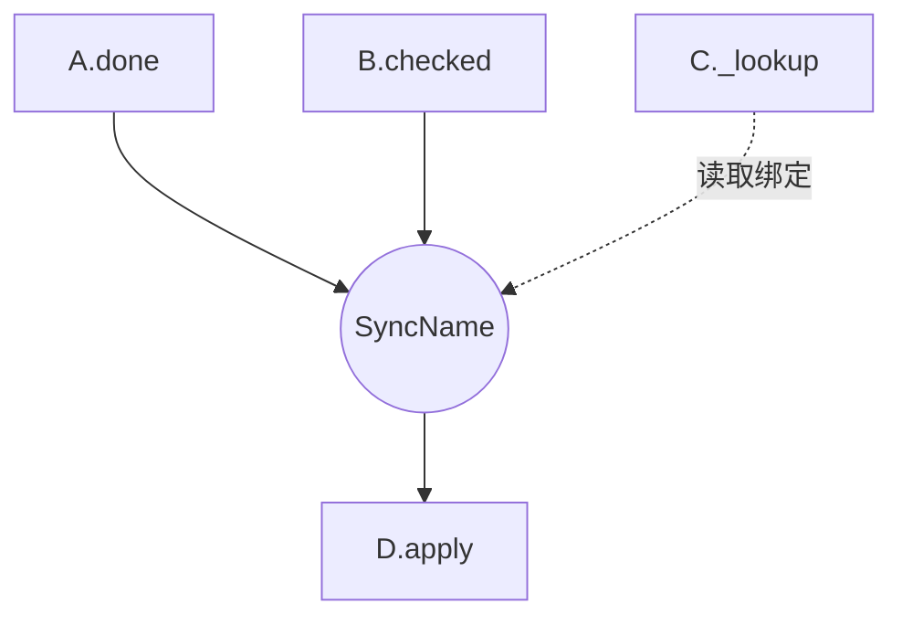

# 架构地图（`map` 模式）

焦点：规格声明了哪些同步、依赖和数据关系？地图是派生导航视图，不是规格或代码正确性的证明，也不由 hooks 消费。无规格时报告缺口，建议 audit；旧格式列待迁移，不生成空图。

## 来源与关系

读取范围内 CONCEPT/PIPELINE/SYNCS、总体 PRD 及暂存索引，排除依赖/生成/构建产物；权威规格只计一次。记录路径、名称、版本和外部引用；范围外目标保留来源，内部缺规格不能误标外部。

| 关系 | 来源及含义 |
| --- | --- |
| 同步 | 每条 sync 一个规则节点，全部 when 连入、then 连出；where 另用查询虚线。保留合取、参数关联及级联，环须标终止/受控运行依据 |
| 产品依赖 | 只取总体 PRD：A → B 表示纳入 A 的产品需要 B；sync 边不能推出它，未声明则标未定义 |
| 数据归属 | PIPELINE sources/outputs/data boundary 给出拥有者、读写接口与方向；有依据才关联 sync，数据引用不自动成为产品依赖 |

默认完整重建并比较，结果相同不写；mtime 漏检删除、重命名和规则变化。只有完整来源集合及内容指纹才支持安全跳过。大量规格可分批/委派只读提取，聚合须核对来源与关系完整性。

## 输出模板

````markdown
# architecture: <项目>

> Generated by `concept-guardrails map` on <日期>
> Scope: <目录、来源清单或索引、规格版本>

## relationship graph



A.done 与 B.checked 共同匹配；query 只绑定值。

## dependency matrix

| Concept | Requires (extrinsic) | Required by |
| --- | --- | --- |
| A | B | — |
| B | — | A |

## data flow paths

- <有规格依据的路径、含义、来源链接>

## coverage

- <已读规格、未建规格的内部引用、范围外目标、未核实来源>
````

## 完成条件

- 节点 ID 稳定且使用 ASCII，冲突以可复现路径后缀区分；标签转义特殊字符，节点/边/矩阵按名称和路径排序。
- 沿用规则/动作名，每种关系明确标注，矩阵逐项列成员；外部/sync/pipeline 仅为视觉分类，不从名字推断层次。
- 可保留样式或拆分大图，但保留跨范围边和来源；未扫描代码分母只报规格数及未解析引用。
- 更新时保留人工作注，报告节点/规则数、关系变化和缺口；地图与代码的符合性另由 drift 验证。

记录模式与旧签名按 [规格契约](spec-format.md) 解析为同一组动作/状态节点；where 的关系模式与 query API 均只画读取边。保留输出 case 和对象关联，不能将成功/错误边合并成无条件触发。
